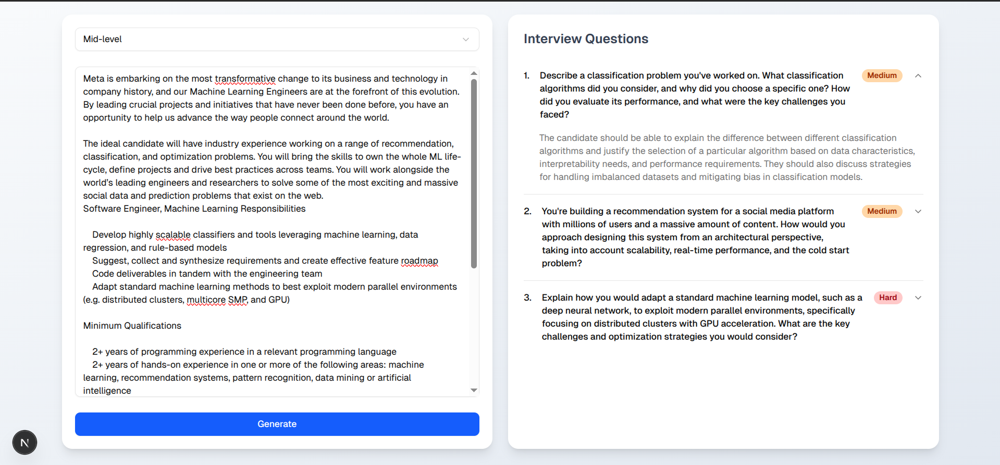

## Question Generation

To generate questions, I've used Next.js' server action and Google's `gemini-2.0-flash` model.

## Technical Implementation
- Next.js (15)
- TypeScript
- Tailwind CSS
- Shadcn UI
- Google's gemini-2.0-flash LLM

## Tradeoffs
Although it's not a big application but for simplicity, I've used Next.js instead of React/Node. It's easier to test prototypes and deploy when using Next.js

## Setup

First, copy the `.env.example` file content into `.env` file and paste the Google's Gemini LLM key (GEMINI_API_KEY=).

Now, run the development server:

```bash
npm install
npm run dev
```

or, run it using Docker (using node:23-alpine image):

```bash
docker compose up
```

Open [http://localhost:3000](http://localhost:3000) with your browser to see the result.

## Enhancements
- User Authentication, Rate Limits and Database
- Also add an input of the candidate's skills (multi select), which can make LLM questions much more relevant
- Record user's answers and ask LLM if candidate should be hired or not; with performance metrics (such as technical/analytical skills, domain knowledge etc..)

## Preview

