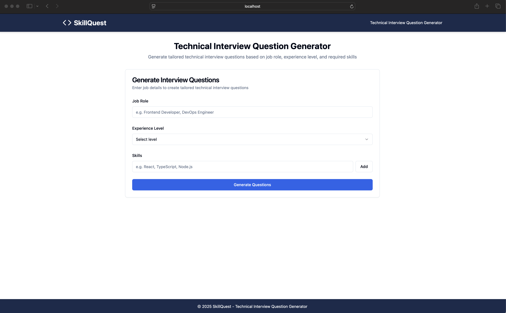
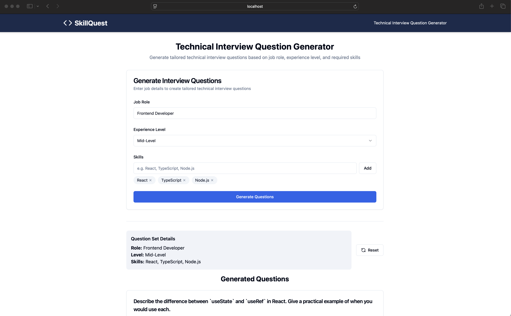
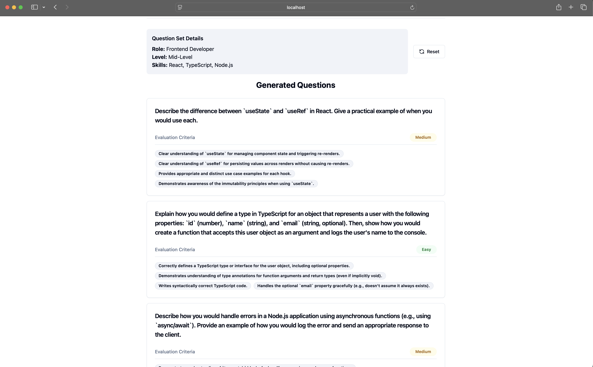

# Quest Skills - Technical Interview Question Generator

A modern web application built with React, TypeScript, and Vite, featuring a rich UI with shadcn/ui components and Google's Generative AI integration.

## 🚀 Features

- 🏗️ Modern React + TypeScript stack
- ⚡ Vite for fast development
- 🎨 shadcn/ui components for a beautiful UI
- 🤖 Google Generative AI integration
- 📱 Responsive design with Tailwind CSS
- 📝 Form handling with react-hook-form
- 🔄 State management with TanStack Query

## 🛠️ Tech Stack

- **Framework**: React 18
- **Type System**: TypeScript
- **Build Tool**: Vite
- **Styling**: Tailwind CSS
- **UI Components**: shadcn/ui
- **State Management**: TanStack Query
- **Form Handling**: react-hook-form
- **AI Integration**: Google Generative AI

## 📦 Project Structure

```
src/
├── components/     # Reusable UI components
├── lib/            # Utility functions and configurations
├── pages/          # Page components
└── services/       # API and service integrations
```


## 📸 Screenshots

### Home Page


### Question Generator


### Generated Questions


## 🚀 Getting Started

1. Install dependencies:
   ```bash
   npm install
   ```

2. Create a `.env.local` file with your environment variables:
   ```
   VITE_GOOGLE_API_KEY=your_api_key_here
   ```

3. Start the development server:
   ```bash
   npm run dev
   ```